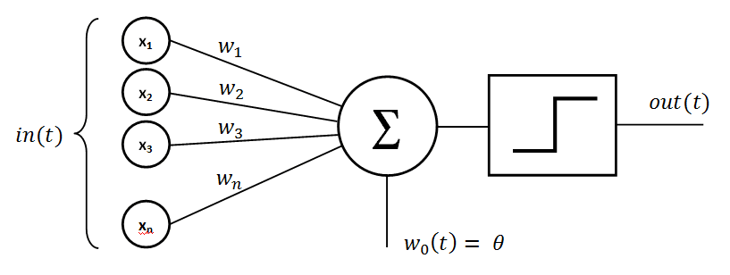

# Neural Networks

### For a great supplement, read [this](https://writings.stephenwolfram.com/2023/02/what-is-chatgpt-doing-and-why-does-it-work/)

---

# Why?

Neural networks are **advanced** machine learning models designed to replicate many observed characteristics of human brains
- Hard to use well
- Difficult to explain clearly
- Highly valuable **in specific contexts**

---

# The basics - Perceptrons

A perceptron is the computational equivalent of a single neuron

Let's describe it with a visual

---

# A perceptron

---

# What is an Activation Function?

An activation function is a math function that determines when a perceptron moves from "off" to "on".

Again, let's describe this visually

---

