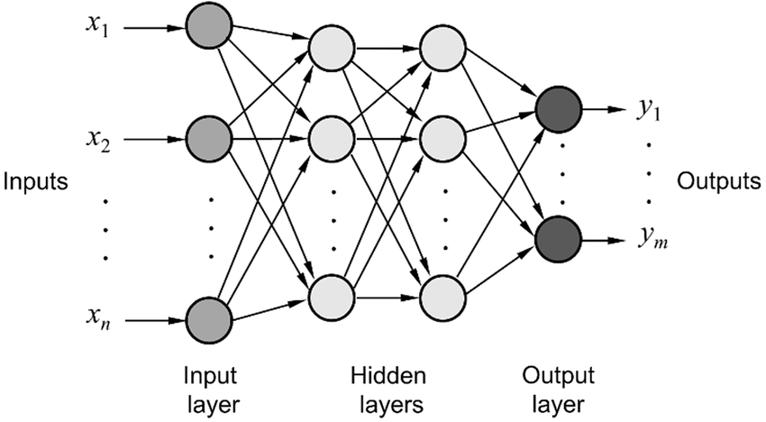
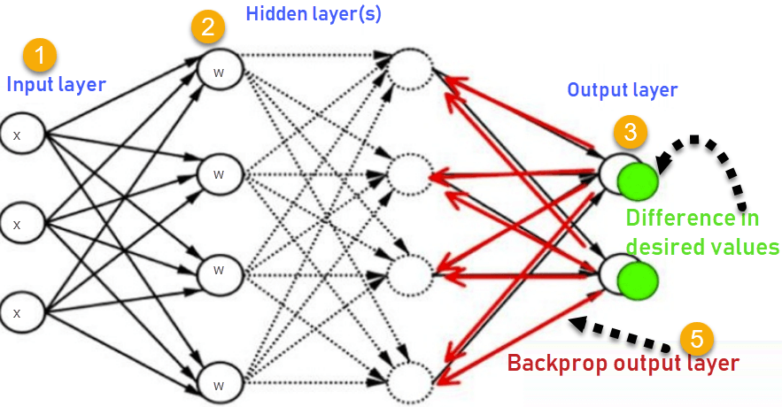

# Neural Networks

### For a great supplement, read [this](https://writings.stephenwolfram.com/2023/02/what-is-chatgpt-doing-and-why-does-it-work/)

---

# Why?

Neural networks are **advanced** machine learning models designed to replicate many observed characteristics of human brains
- Hard to use well
- Difficult to explain clearly
- Highly valuable **in specific contexts**

---

# The basics - Perceptrons

A perceptron is the computational equivalent of a single neuron

Let's describe it with a visual

---

# A perceptron

---

# What is an Activation Function?

An activation function is a math function that determines when a perceptron moves from "off" to "on".

Again, let's describe this visually

---

---

# How does this make a Neural Network?

Neural networks are made up of **layers** of perceptrons that are interconnected, leading from the **input layer** to the **output layer**.

Any layer in between is called a **hidden layer**. Neural networks are often referred to as **deep learning** because of these hidden layers making the nerual network "deep".

---

---

# How do we use them?

Our goal with a neural network is to train our network with **weights** and **biases** (these are what trigger the activation functions, remember?) so that the network is able to represent the complex process of predicting our outcome of interest.

---

# How we learn - Backpropagation

---

# How we learn - Backpropagation

Through inputs and backpropagation, we train our model to perform as well as we can on our task.

How do we choose the right network?

---

# Choosing the right network

1. Use one that someone else designed for the same (or similar) tasks
2. Evolutionary algorithms ("neuroevolution")
    - Here's an example: https://www.youtube.com/watch?v=qv6UVOQ0F44
3. Trial and error (probably not efficient)

---

# Using PyTorch to work with Neural Networks