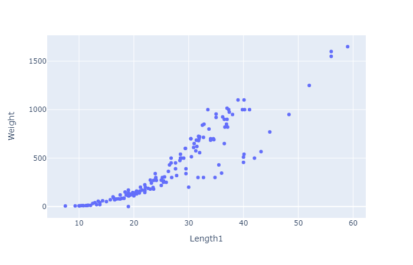
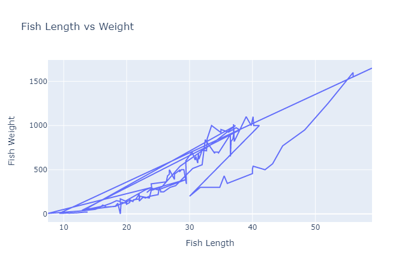
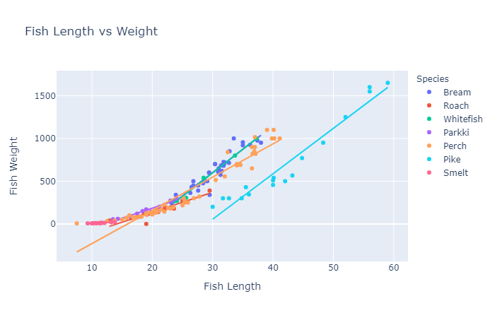
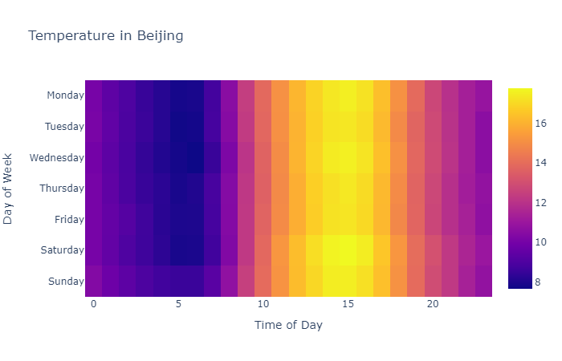

# Using Plotly to Make Figures and Charts

---

# Why Use Plotly?

Plotly is a good choice for several reasons:

- It allows for easy interactive plotting
- Interactive plots can be embedded in notebooks
- Can be run on a server
- Plotly has developed a dashboard API to complement their plotting library (similar to Shiny for R)
- It also has a shorthand library [`plotly_express`](https://plotly.express) for rapid exploration


---


# Getting Started

```python
import plotly.express as px
```

First, we want to import `plotly.express`, which will serve as the engine for creating our figures in `plotly`.

---


# Creating Plot Objects

```python
px.scatter(# initialize scatter object
  x = list(range(2000,2010)), # pass x, y values
  y = [29.8,30.1,30.5,30.6,31.3,31.7,32.6,33.1,32.7,32.8])
```

<br>

In this (very) simple example, we plot some time series data. Our figure is rendered in the notebook.

---



In this (very) simple example, we plot some time series data. Our figure is rendered in the notebook.

---

# Formatting

Let's add some formatting. First, we can change the axis labels and title to match :

```python
px.scatter(# initialize scatter object
    x = list(range(2000,2010)), # pass x, y values
    y = [29.8,30.1,30.5,30.6,31.3,31.7,32.6,33.1,32.7,32.8],
    title = "PCC by Year", # update the title of the figure
    labels = { # dictionary for axis labels
        'x' : 'Year', # key should match original label
        'y' : "PCC" # value should be new label value
    }
)
```

---


---

# Trendlines

Next, we can add a regression trendline:

```python
px.scatter(# initialize scatter object
    x = list(range(2000,2010)), # pass x, y values
    y = [29.8,30.1,30.5,30.6,31.3,31.7,32.6,33.1,32.7,32.8],
    title = "PCC by Year", # update the title of the figure
    labels = { # dictionary for axis labels
        'x' : 'Year', # key should match original label
        'y' : "PCC" # value should be new label value
    },
    trendline = 'ols' # add a linear trendline
)
```

We can also use `lowess` trendlines!

---


---

# Line Charts

We could instead use line charts

```python
px.line(# initialize line object
    x = list(range(2000,2010)), # pass x, y values
    y = [29.8,30.1,30.5,30.6,31.3,31.7,32.6,33.1,32.7,32.8],
    title = "PCC by Year", # update the title of the figure
    labels = { # dictionary for axis labels
        'x' : 'Year', # key should match original label
        'y' : "PCC" # value should be new label value
    }
    )
```

---



---

# Creating Plot Objects

We can add text to our markers that can be seen when mousing over the points:

```python
px.line(# initialize line object
    x = list(range(2000,2010)), # pass x, y values
    y = [29.8,30.1,30.5,30.6,31.3,31.7,32.6,33.1,32.7,32.8],
    title = "PCC by Year", # update the title of the figure
    labels = { # dictionary for axis labels
        'x' : 'Year', # key should match original label
        'y' : "PCC" # value should be new label value
    }
    )
```

---

# Creating Plot Objects

Let's add a second series:

```python
import pandas as pd

data = pd.DataFrame({'x': list(range(2000,2010))*2,
                     'y': [29.8,30.1,30.5,30.6,31.3,31.7,32.6,33.1,32.7,32.8]
                     +[327,456,509,497,596,573,661,741,809,717],
                     'z': ["PCC"]*10 + ["DIB"]*10})

# Note that the data is "tall", so that the series are stacked
#   with a third column to denote which values belong to
#   each series.

px.line(data, x='x', y='y', color='z',
    title = "PCC by Year", # update the title of the figure
    labels = { # dictionary for axis labels
    'x' : 'Year', # key should match original label
    'y' : "PCC/DIB", # value should be new label value
    'z' : "Series" # add label for legend
    })
```

---

# Creating Plot Objects

Our plot now looks something like this:



Evidently, these are not the best series to plot together! :confused:

---


# Other Plot Types

We can do a LOT more than scatter plots!


- [Bar Charts](https://plotly.com/python/bar-charts/)
- [Box Plots](https://plot.ly/python/box-plots/)
- [Histograms](https://plot.ly/python/histograms/), with distribution stats, too!
- [Heatmaps](https://plot.ly/python/heatmaps/)
- [Choropleth](https://plot.ly/python/choropleth-maps/), [Line](https://plot.ly/python/lines-on-maps/), and [Bubble Maps](https://plot.ly/python/bubble-maps/)

among many others.

---

# Using Existing Data


Let's import a `pandas` Data Frame to play with some :fish: data:

```python
import pandas as pd

data = pd.read_csv(
    "https://github.com/dustywhite7/pythonMikkeli/raw/master/exampleData/fishWeight.csv")
```

---


# Using Existing Data

First, we can make a bar chart:

```python
px.bar(data, y="Weight", color="Species")
```


---


---

# Histogram

Maybe that data would do better if we could aggregate it in bins to better understand how many fish were observed in each weight bin:

```python
px.histogram(data, 
        x="Weight", 
        marginal="rug", 
        color="Species",  
        color_discrete_sequence=px.colors.qualitative.Prism)
```

---


---

# Box Plots


```python
px.box(data, y="Weight", color="Species")
```

---


---

# Heatmaps

```python
data = pd.read_csv(
    "https://raw.githubusercontent.com/dustywhite7/pythonMikkeli/master/exampleData/pollutionBeijing.csv")

data['datetime'] = pd.to_datetime(data['datetime'])
data['weekday'] = data['datetime'].dt.dayofweek
data['hour'] = data['datetime'].dt.hour
data = data.groupby(['weekday', 'hour'])['TEMP'].mean()
data = data.values.reshape((24,7))

px.imshow(data, title="Temperature in Beijing" ,
          labels=dict(x="Day of Week", y="Time of Day"), 
          x=['Monday', 'Tuesday', 'Wednesday', 'Thursday', 'Friday', 'Saturday', 'Sunday'])
```

---



---

# Choropleth Maps

```python
data = pd.read_csv(
  "https://raw.githubusercontent.com/dustywhite7/Econ8320/master/LabCode/corruption2018.csv")

px.choropleth(data, locations = 'Abbr',
    color = 'Index',
    hover_name= "Name"
    )
```

Map data from the [INFORM Index](http://www.inform-index.org/Results/Global)

---


---

# Mapping Options: Layout->Geo

We have many additional options that we can pass to the layout of our plot when dealing with geographic data.

- Map projection
- Map scope
- Country lines
- Lots more

Here is a link to the [full documentation](https://plot.ly/python/reference/#layout-geo)

---

# Choropleth Maps - Projection

```python
px.choropleth(data, locations = 'Abbr',
    color = 'Index',
    hover_name= "Name",
    projection = "orthographic"
    )
```

---


---

# Choropleth Maps - Scope

```python
px.choropleth(data, locations = 'Abbr',
    color = 'Index',
    hover_name= "Name",
    scope = "europe"
    )
```


---


---


# Bubble Maps

```python
data = pd.read_csv(
  "https://raw.githubusercontent.com/dustywhite7/Econ8320/master/LabCode/displaced2018.csv")

px.scatter_geo(data, locations="Abbr", 
                     hover_name="Name", size="Displaced",
                     projection="natural earth")
```

---


---

# Lab Time!