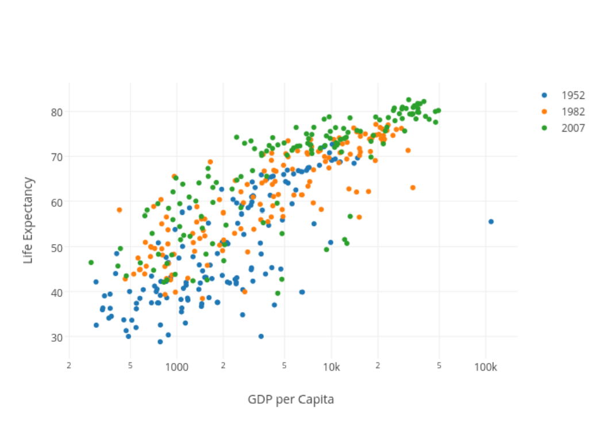
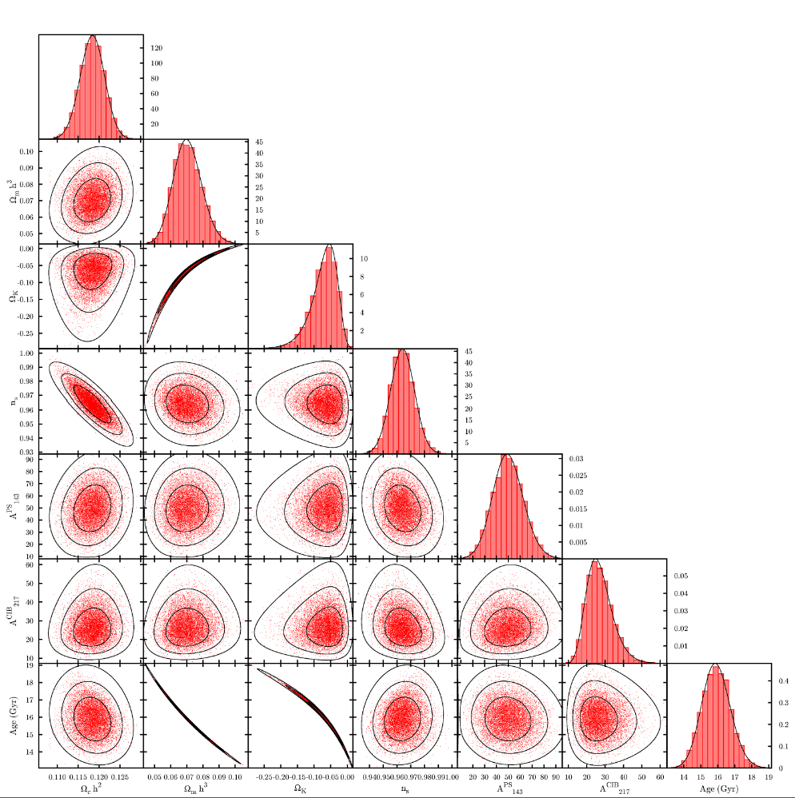
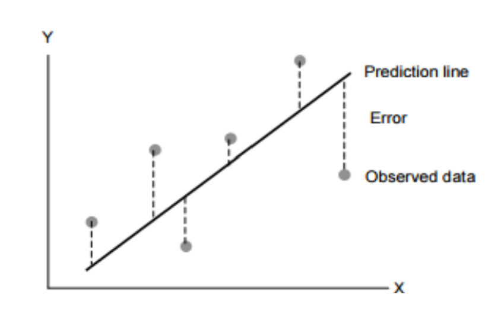
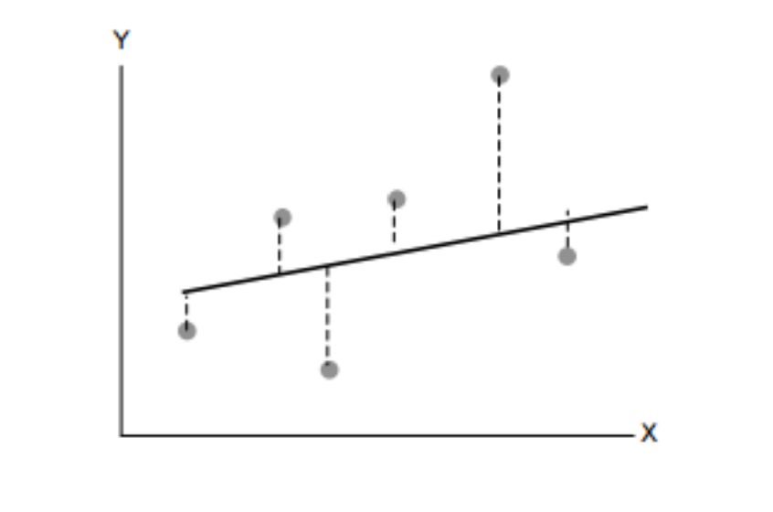
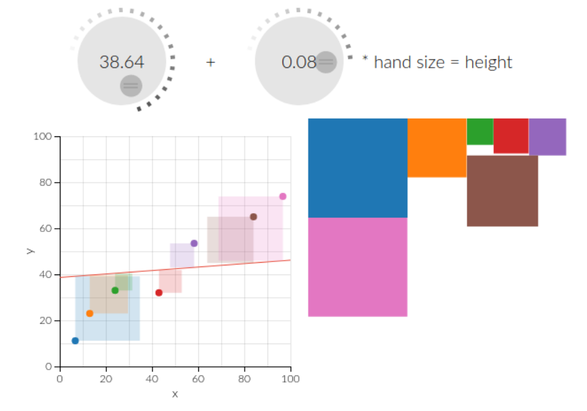
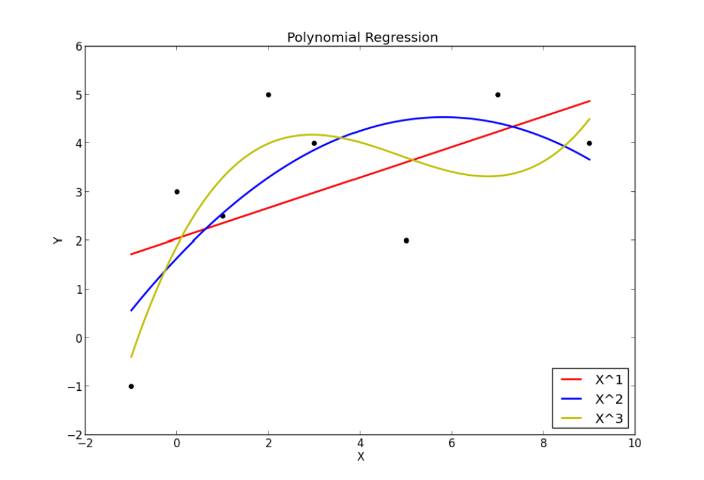
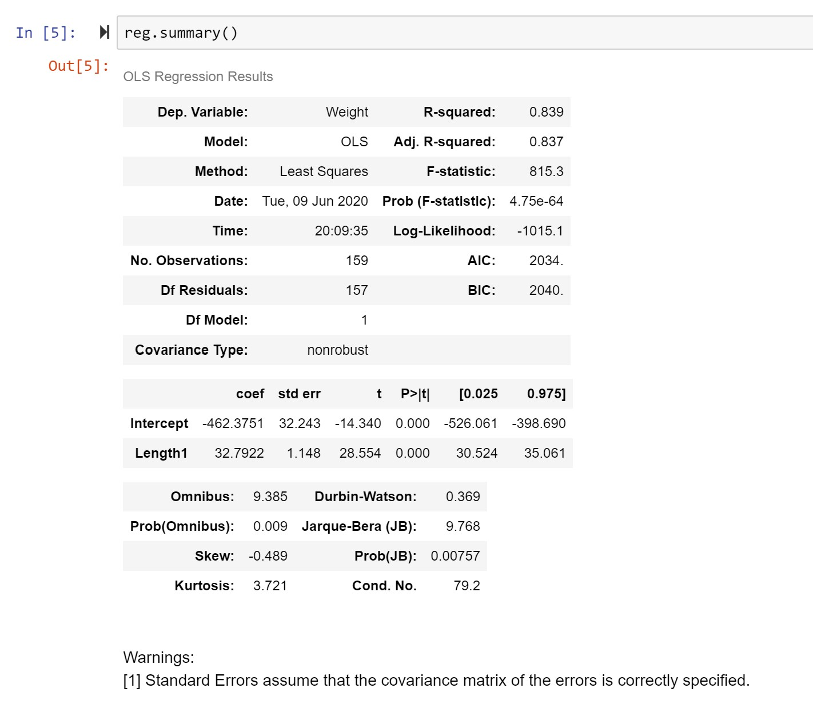

# Regressions

---

# Cause and Effect

[Correlation](http://www.tylervigen.com/spurious-correlations): Two variables are correlated when changes in one variable occur in a pattern corresponding to changes in the other.

---

# Cause and Effect

Causation: One variable moves, and the second variable changes because of the movement of the first.


---

# Questioning Causality

When we suspect a causal relationship (that $x$ causes $y$), it is important to ask ourselves several questions:

1. Is it possible that $y$ causes $x$ instead?
2. Is it possible that $z$ (a new factor that we haven't considered before) is causing both $x$ and $y$?
3. Could the relationship have been observed by chance?

---

# Establishing Causality

In order to establish causality, we need to meet several conditions:

- We can explain **why** $x$ causes $y$
- We can demonstrate that **nothing else is driving the changes** (within reason)
- We can show that there is a **correlation** between $x$ and $y$

---

# Ceteris Paribus

*ceteris paribus* means "all else equal"

---

# Regression analysis

- Allows us to **act as if nothing else were changing**
- Mathematicaly isolates the effect of each individual **variable** on the outcome of interest
    - Variables are the factors that we want to include in our model

---

# Regression analysis

- Think about it like a trend line!


---

# Regression analysis



Whoops! What if there is another variable?

---

# Regression analysis



Or lots of variables??

---

# Minimize Errors and Best Fit Lines

| Best Fit | Something Else |
:-------------------------:|:-------------------------:
  |  

---

# Minimize Errors and Best Fit Lines

[Try it by hand!](http://setosa.io/ev/ordinary-least-squares-regression/)



---

# Why LINEAR regression?

- Faster
- More honest



---

# OLS in Python

```python
import pandas as pd
import statsmodels.formula.api as smf

data = pd.read_csv(
    "https://github.com/dustywhite7/pythonMikkeli/raw/master/exampleData/fishWeight.csv")

reg = smf.ols("Weight ~ Length1", data=data)

reg = reg.fit()

print(reg.summary())
```

---




---

# Regression Equations

```python
dependent ~ x1 + x2 + x3 + ...
```

We can force variables to be categorical:

```python
dependent ~ x1 + x2 + C(x3) + ...
```

Here, we make `x3` categorical


---

# Regression Equations

```python
dependent ~ x1 + x2 + x3 + ...
```

We can use arithmetic transformations:

```python
dependent ~ x1 + I(x2**2) + x3 + ...
```

Here, we square `x2`

---

# When OLS Fails

OLS is an inappropriate model whenever you have a binary or discrete dependent variable (think "yes" or "no" questions)

In this case, you should use Logistic Regression instead. More details can be found in the class notes on Mimir/Github.

---

# Implementing Logistic Regressions

```python

formula = "y ~ all_of_the_xs" 

reg = smf.logit(formula, data)

reg = reg.fit()

reg.summary()
```

---

# Lab Time!